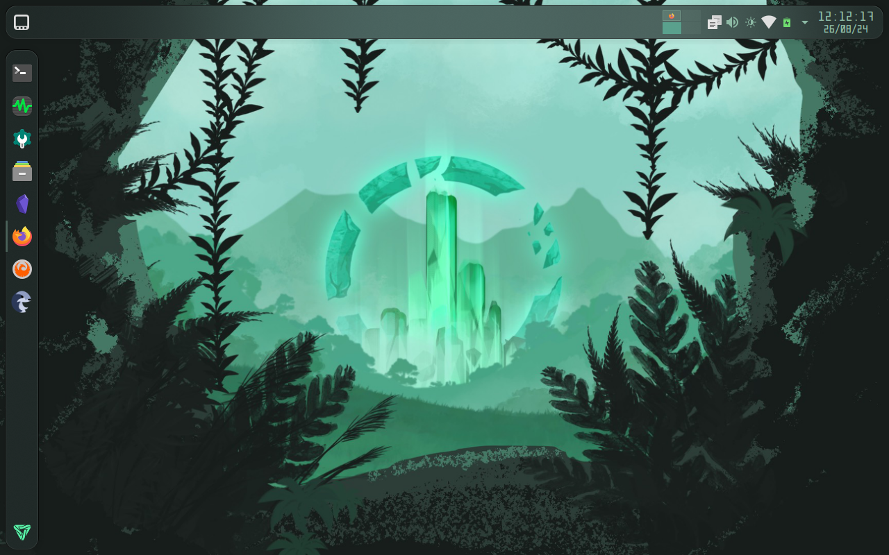
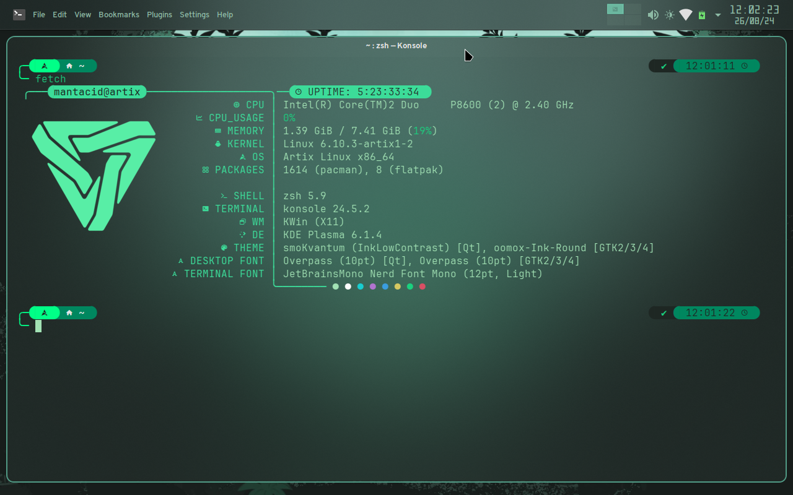
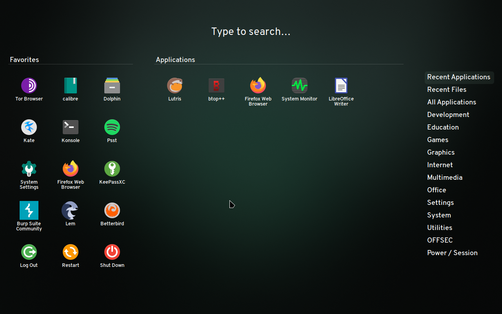
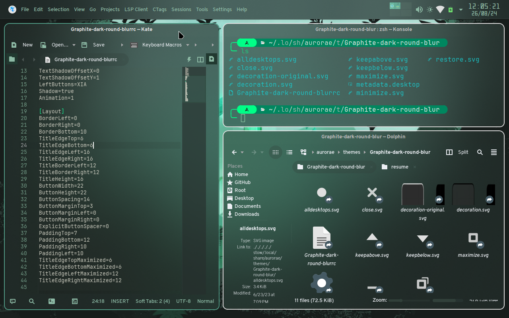

# Installation
These dotfiles were created and managed using `stow`, and thus require the tool to be installed.
See `man stow` for information on how to use the tool.

`zinit` will also need to be installed and set up, at which point the dotfiles can be loaded to the target folders. The zsh plugins *should* install automatically.

# Screenshots

